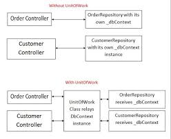

# Repository-pattern
generic repository pattern c# unit of work
مقدمه:
در توسعه نرم‌افزار، طراحی پایگاه داده و ارتباط با آن یکی از مهمترین جنبه‌هاست. استفاده از الگوهای طراحی مختلف می‌تواند به بهبود کارایی و تعمیرپذیری برنامه کمک کند. در این مقاله، به بررسی الگوهای Generic Repository و Unit of Work در محیط .NET 7 خواهیم پرداخت و نحوه استفاده از آن‌ها را برای بهبود مدیریت ارتباط با پایگاه داده در برنامه‌های .NET 7 مورد بررسی قرار خواهیم داد.

Generic Repository:
الگوی Generic Repository یکی از الگوهای طراحی متداول در توسعه نرم‌افزار است که برای جلوگیری از تکرار کد در عملیات پایگاه داده استفاده می‌شود. با استفاده از این الگو، می‌توان اعمال مختلف CRUD (Create, Read, Update, Delete) را در یک مخزن مشترک برای تمامی موجودیت‌ها انجام داد. در .NET 7، این الگو بهبود یافته و توانایی کار با پیچیدگی‌های بیشتر را داراست.

Unit of Work:
الگوی Unit of Work به عنوان یک واحد مدیریتی برای تراکنش‌های پایگاه داده عمل می‌کند. این الگو اجازه می‌دهد تا تراکنش‌های چندگانه را در یک بلافاصله انجام داده و تغییرات را به صورت اتمی به پایگاه داده اعمال کنیم. در .NET 7، Unit of Work بهبود یافته و سازگاری بهتری با Entity Framework و دیگر فریم‌ورک‌های ORM دارد.

نحوه استفاده از Generic Repository و Unit of Work در .NET 7:
برای استفاده از Generic Repository و Unit of Work در .NET 7، می‌توانید مراحل زیر را دنبال کنید:

ایجاد یک Generic Repository برای هر موجودیت:
برای هر موجودیت در پروژه خود، یک Generic Repository ایجاد کنید. این مخازن عملیات CRUD را بر روی موجودیت‌های مرتبط انجام می‌دهند.

ایجاد یک Unit of Work:
یک واحد Unit of Work ایجاد کنید که شامل تمامی Generic Repository‌ها برای مدیریت تراکنش‌های پایگاه داده باشد. این واحد مسئول شروع و پایان تراکنش‌ها و ذخیره تغییرات به صورت اتمی است.

استفاده از Dependency Injection:
استفاده از ابزار Dependency Injection در .NET 7 به شما امکان می‌دهد تا Generic Repository و Unit of Work را به راحتی در کلاس‌های خود تزریق کنید و از آن‌ها استفاده کنید.

اجرای تراکنش‌ها:
با استفاده از Unit of Work، می‌توانید تراکنش‌های پایگاه داده را شروع کنید و پس از انجام تغییرات، آن‌ها را ذخیره کنید. این کار به شما اطمینان می‌دهد که تراکنش‌ها به درستی اعمال می‌شوند یا در صورت خطا لغو می‌شوند.

نتیجه‌گیری:
استفاده از الگوهای Generic Repository و Unit of Work در .NET 7 می‌تواند به بهبود مدیریت ارتباط با پایگاه داده و کاهش تکرار کد کمک کند. این الگوها باعث افزایش تعمیرپذیری، کارایی و امنیت برنامه می‌شوند. در نتیجه، توصیه می‌شود که آن‌ها را در پروژه‌های .NET 7 خود به کار ببرید.

itle: "Exploring the Disconnect with Generic Repository and Unit of Work in .NET 7"

Introduction:
In software development, designing a database and managing its interaction is a critical aspect. Utilizing various design patterns can improve program efficiency and maintainability. In this article, we will delve into the Generic Repository and Unit of Work patterns in the context of .NET 7 and discuss how to use them to enhance database management in .NET 7 applications.

Generic Repository:
The Generic Repository pattern is a widely-used design pattern in software development, aimed at avoiding code duplication in database operations. With this pattern, various CRUD (Create, Read, Update, Delete) operations can be performed on a common repository for all entities. In .NET 7, this pattern has been enhanced to handle more complex scenarios effectively.

Unit of Work:
The Unit of Work pattern acts as a management unit for database transactions. This pattern allows multiple transactions to occur concurrently and ensures that changes are applied atomically to the database. In .NET 7, the Unit of Work has been improved and provides better compatibility with Entity Framework and other ORM frameworks.

How to Use Generic Repository and Unit of Work in .NET 7:
To utilize the Generic Repository and Unit of Work patterns in .NET 7, follow these steps:

Create a Generic Repository for Each Entity:
For each entity in your project, create a Generic Repository. These repositories perform CRUD operations on related entities.

Establish a Unit of Work:
Create a Unit of Work that encompasses all Generic Repositories for managing database transactions. This unit is responsible for starting and completing transactions and saving changes atomically.

Leverage Dependency Injection:
Utilize Dependency Injection in .NET 7 to easily inject Generic Repositories and Unit of Work into your classes and use them.

Execute Transactions:
With the Unit of Work, you can start transactions, make changes, and then commit those changes. This ensures that transactions are applied correctly or rolled back in case of errors.

Conclusion:
Using the Generic Repository and Unit of Work patterns in .NET 7 can improve database management, reduce code duplication, and enhance program efficiency and security. Consequently, it is recommended to employ these patterns in your .NET 7 projects for better database interaction and maintenance.
